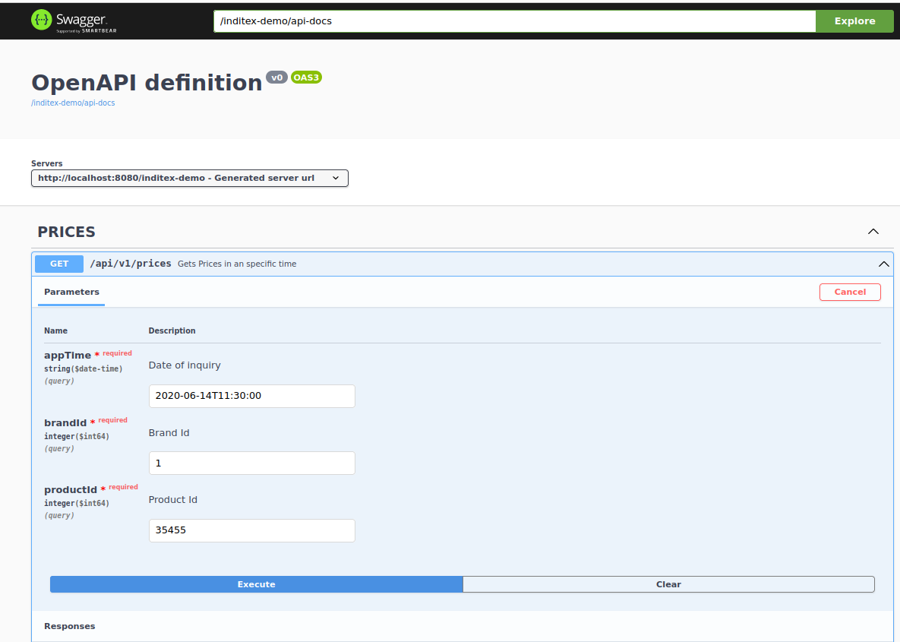

# Test para Inditex

## Resumen
Se trata de un pequeño microservicio para la consulta de Precios para una marca, producto y fecha determinados. Para ello se toma como base una tabla en una BBDD H2 en memoria autocargada con el arranque de la aplicacion

## Detalles
La aplicación esta desarrollada usando Jva 17 + Spring como framework y usa un patrón MVC típico con:

  - Controller para la recepción de las petciones. En ellos solo se recibe la petición y se validan parámetros dejando la lógica de negocio para la capa Service.
  - Service para la ejecución de la lógica de negocio usando componentes Repository.
  - Repository como componente para la obtención de los datos solicitados.
  
## Ejecución
Se podrá ejecutar usando maven. Es necesario que en el entorno esté configurado con JAVA_HOME java 17. Se deberá lanzar desde la carpeta de example-api.

```cmd
cd example-api > mvn spring-boot:run
```
Los test se podrán ejecutar con:

```cmd
mvn test
```

Igualmente se podrá ejecutar y debugear desde cualquier IDE (IntelliJ, STS, etc.)

Sobre el mismo se podrán lanzar peticiones usando el comando curl del siguiente modo:
 
```cmd
curl -X 'GET' 'http://localhost:8080/inditex-demo/api/v1/prices?appTime=22020-06-14T11%3A30%3A00&brandId=1&productId=35455' -H 'accept: application/json'
```
y se obtedrá un resultado como el siguiente:

```json
{
  "brandId": 1,
  "startDate": "2020-06-14T00:00:00",
  "endDate": "2020-12-31T23:59:59",
  "priceList": 1,
  "productId": 35455,
  "price": 35.5
}
```

Hay que tener en cuenta que los parametros todos son obligatorios. Las fechas se podrán cambiar de acuerdo con los requerimientos de consulta y hay que tener en cuenta que el formato de fecha deberá atener al estándar ISO-8601

También se podrá usar la documentación generada con openAPI y accesible desde la url http://localhost:8080/inditex-demo/swagger-ui/index.html



## Revisión de Código
El presente microservicio esta construido siguiendo los principales patrones de diseño (Creational, Structural y Behavioral Patterns) y el Patrón de arquitectura hexagonal. Por este motivo el proyecto está dividido en capas de Dominio, Aplicacion e Infraestructura (api en este caso), de modo que desde una capa mas interna no se accede a nada de una capa más externa, ni nada que haga referencia al framework utilizado. Para ello se incluye la clase de test LayerDependencyRulesTest en la cual se ArchUnit. 

Para la implmentación de las capas se han usado módulos de maven.

En el módulo (Infraestructura) example-api se pueden observar los siguientes componentes principales.

### Controlador
Clase anotada con @RestController en la que se reciben las peticiones, se validan los parámetros se invoca la lógica de negocio implementada en un @Service y se devuelven los resultados en un objeto DTO.

 ```java
	@RestController
	@RequestMapping("/api/v1")
	@Validated
	@RequiredArgsConstructor
	public class PricesController {

        private final PricesService pricesService;
    
        private final PricesDtoMapper mapper;
    
        @Operation(summary = "Gets Prices in an specific time", description = "", tags = {"PRICES"})
        @RequestMapping(value = "/prices",
                produces = MediaType.APPLICATION_JSON_VALUE,
                method = RequestMethod.GET)
        @ApiResponse(responseCode = "200", description = "Getted Prices",
                content = {@Content(mediaType = "application/json", schema = @Schema(implementation = PricesDto.class))})
        @ResponseStatus(value = HttpStatus.OK)
        public ResponseEntity<PricesDto> getPrices(
                @Parameter(name = "appTime", required = true, description = "Date of inquiry in format yyyy-MM-dd'T'HH:mm:ss.SSSXXX (2000-10-31T01:30:00.000-05:00)")
                @RequestParam(value = "appTime", required = true) @DateTimeFormat(iso = DateTimeFormat.ISO.DATE_TIME) LocalDateTime appTime,
                @Parameter(name = "brandId", required = true, description = "Brand Id")
                @RequestParam(value = "brandId", required = true) @Min(value = 1, message = "Must be a positive Integer") long brandId,
                @Parameter(name = "productId", required = true, description = "Product Id")
                @RequestParam(value = "productId", required = true) @Min(value = 1, message = "Must be a positive Integer") long productId) {
    
        }
    }
```

Para el mapeo del objeto de salida se ha utilizado MapStruct el cual facilita en gran medida esta tarea.

Al tratarse de arquitectura hexagonal en este modulo se usa el servicio de la capa Applicacion (módulo example-appication), donde se implementa la logica de negocio. Al estar definida como una clase sin nada de Spring es necesario inyectarla en este creandola en:

```java
@Configuration
public class PricesConfiguration {
    @Bean
    public PricesService pricesService(PricesRepository pricesRepository) {
        return new PricesService(pricesRepository);
    }
}
```

Adicionalmente en este modulo se implementa el control de errores con una clase anotada con @ControllerAdvice.

Para terminar en este módulo se implementa en acceso a los datos mediante un Component (PricesRepositoryImpl) que es la implementacion del repository definido en la capa Domain (PricesRepositoryImpl) y que adicionalmente usa SpringDataJPA definido en la interfaz PricesJpaRepository anotada con @Repository.

```java
    @RequiredArgsConstructor
    @Component
    public class PricesRepositoryImpl implements PricesRepository {
        private final PricesJpaRepository jpaRepository;
    
        private final PricesEntityMapper mapper;
    
        @Override
        public List<Prices> findAll() {
            return mapper.map(jpaRepository.findAll());
        }
    
        @Override
        public List<Prices> getPrices(LocalDateTime appTime, long brandId, long productId) {
            return mapper.map(jpaRepository.getPrices(appTime, brandId, productId));
        }
    
    }
```
La creación y carga de la BBDD en memoria se configura con:

```property
database: h2
spring.sql.init.schema-locations: classpath*:db/${database}/schema.sql
spring.sql.init.data-locations: classpath*:db/${database}/data.sql
```

### Service
Clase definida en el módulo Application (example-application) en la que se invoca la lógica de negocio para lo cual se utiliza la interfaz Repository definida en la capa Domain de modo que en esta capa no se use nada de una capa superior ni de framework.

 ```java

    @RequiredArgsConstructor
    public class PricesService {
        private final PricesRepository pricesRepository;
        
        public Optional<Prices> getPrices(LocalDateTime appTime, long brandId, long productId)  {
    
            List<Prices> pricesEntity = pricesRepository.getPrices(appTime, brandId, productId);
    
            return pricesEntity.stream().findFirst();
        }
    }
```

Durante todo el desarrollo se utiliza lombok lo cual ayuda en gran medida para obtener Clean Code.

### Repository
Interfaz definida en el módulo Domain (example-domain) en la que se define el acceso a la BBDD en este caso, o a cualquier otro medio al ser agnóstica a la implementación.


 ```java
    public interface PricesRepository {
    
        List<Prices> getPrices(LocalDateTime appTime, long brandId, long productId);
    
        List<Prices> findAll();
    }
```


 
